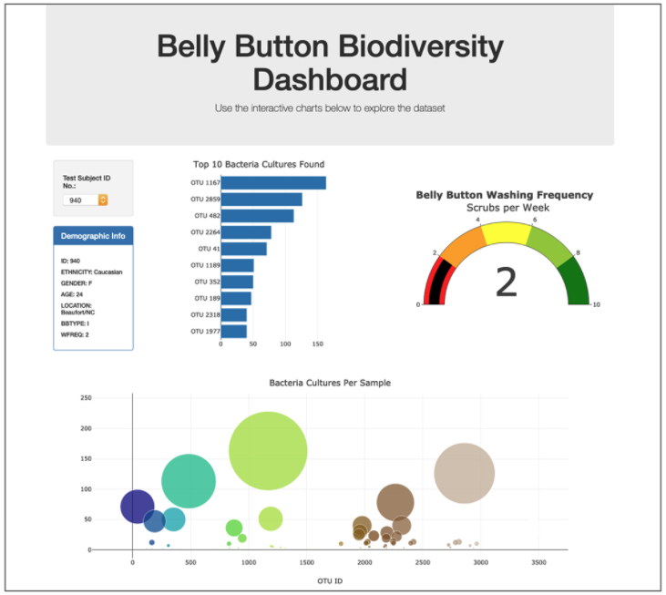

# Plotly_Deployment

Use of Plotly.js, HTML, and JavaScript to create a basic plots with Plotly, including bar charts, line charts, and pie charts. Use D3.json() to fetch external data, such as CSV files and web APIs, and Deploy an interactive chart to GitHub Pages.

### Overview

Roza has a partially completed dashboard that she needs to finish. She has a completed panel for demographic information and now needs to visualize the bacterial data for each volunteer. Specifically, her volunteers should be able to identify the top 10 bacterial species in their belly buttons. That way, if Improbable Beef identifies a species as a candidate to manufacture synthetic beef, Roza's volunteers will be able to identify whether that species is found in their navel.

### Results

On the webpage, see index.html file link below in this repository:

https://jsaltmd.github.io/plotly_deployment/

The following charts were created:

* Horizontal Bar Chart
* Bubble Chart
* Gauge Chart

And these charts are presented in a customized dashboard as shown on the example picture below:

When the user enter a search criteria (test subject ID number) on the pull down menu, the information are then presented on the dashboard.

### Summary

The dashboard was customized with the following features: (minimum challenge requirement is three).

* Added an image to the jumbotron.
* Added background color or a variety of compatible colors to the webpage.
* Added information about what each graph visualizes, either under or next to each graph.
* Made the webpage mobile-responsive.

